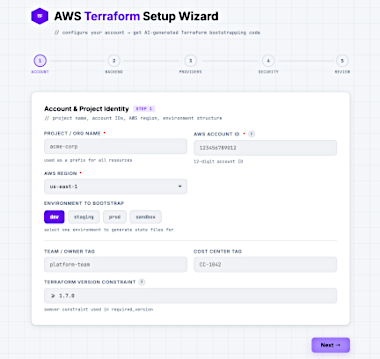

# AWS Terraform Setup Wizard

A browser-based tool that generates Terraform configuration files for AWS account setup. Fill out a guided form, click **Generate Terraform Files**, and receive a complete, commented set of `.tf` files ready to hand off to your cloud or DevOps team.

---

## How It Works

The wizard walks you through five steps:

1. **Account** — Project name, primary region, environments (dev, staging, prod, etc.), default tagging strategy, and CI/CD platform
2. **Backend** — State backend type (S3 only, S3 + DynamoDB locking, or Terraform Cloud), with fields for bucket names, lock tables, or TFC org/workspace as appropriate
3. **Providers** — AWS provider version constraints and authentication method (IAM role assumption, environment variables, named profile, or OIDC)
4. **Security** — Security guardrails such as MFA requirements, IP restrictions, and password policy options
5. **Review** — A summary of all selected options before generation

On submit, the configuration is sent to the Anthropic API via a secure server-side proxy. The generated output is a set of named `.tf` files (`main.tf`, `versions.tf`, `backend.tf`, `providers.tf`, and others as applicable), each displayed in a syntax-highlighted panel with a one-click copy button. A zip file download link is also provided. 

---

## Prerequisites

- A [Vercel account](https://vercel.com/signup) (free tier is sufficient)
- An [Anthropic API key](https://console.anthropic.com/)
- [Node.js](https://nodejs.org/) installed locally
- [Git](https://git-scm.com/) installed locally

---

## Deploying to Vercel

### 1. Clone and prepare

```bash
git clone <your-repo-url>
cd <repo-directory>
```

### 2. Deploy

```bash
npm install -g vercel
vercel deploy --prod
```

### 3. Set the API key environment variable

The serverless function at `api/generate.js` requires `ANTHROPIC_API_KEY` to be set. Add it via the Vercel CLI:

```bash
vercel env add ANTHROPIC_API_KEY
```

Or in the Vercel dashboard: **Project → Settings → Environment Variables**.

The key is never exposed to the browser — all Anthropic API calls are proxied through the serverless function.

---

## Project Structure

```
.
├── public/
│   └── index.html                # Single-page frontend (no build step)
├── api/
│   └── generate.js               # Vercel serverless function — Anthropic API proxy
├── images/                       # README screenshots
└── vercel.json                   # Routing config
```

---

## Security Notes

- **API key isolation** — `ANTHROPIC_API_KEY` lives only in Vercel's environment; the browser never sees it.
- **IP restriction** — To limit access to your corporate network or VPN, add an IP allowlist in your Vercel project settings or via a middleware function.
- **Rate limiting** — Per-IP cooldown is enforced via Vercel KV. See the Rate Limiting section below for setup.

---

## Setting Up Rate Limiting (Vercel KV)

The API route uses **Vercel KV** (serverless Redis) to enforce a cooldown per IP address between generation requests. Without it, anyone who discovers your URL could run up your Anthropic bill.

### 1. Create a KV store

In your Vercel dashboard:

1. Go to **Storage** → **Create Database** → **KV**
2. Give it a name (e.g. `wizard-kv`) and click **Create**
3. On the next screen, click **Connect to Project** and select your project

Vercel will automatically add `KV_REST_API_URL` and `KV_REST_API_TOKEN` to your project's environment variables.

### 2. Redeploy

```bash
vercel deploy --prod
```

The rate limiter is now active. Each IP can generate once per cooldown window. If they try sooner, they will see a message telling them exactly how many seconds to wait.

> **Note:** If KV is unavailable for any reason, the function fails open — requests go through rather than being blocked. This prevents a KV outage from taking down the whole tool.

### Changing the Rate Limit Window

The cooldown duration is controlled by a single constant at the top of `api/generate.js`:

```javascript
const RATE_LIMIT_SECONDS = 120; // 2-minute cooldown per IP
```

| Value  | Cooldown            |
| ------ | ------------------- |
| `60`   | 1 minute            |
| `120`  | 2 minutes (default) |
| `3600` | 1 hour              |

After editing, redeploy for the change to take effect.

### Changing What Gets Rate Limited

By default the limit is per IP. To apply a single shared limit across all users:

```javascript
const rateLimitKey = `rl:global`;
```

Or scope it per authenticated user if your deployment adds an auth header:

```javascript
const rateLimitKey = `rl:${req.headers['x-user-id'] || clientIp}`;
```

### Viewing and Clearing Rate Limit State

To manually clear a rate limit (e.g. during testing or if a legitimate user is incorrectly blocked):

1. Go to **Storage** in your Vercel dashboard and select your KV store
2. Click **Data Browser**
3. Keys are stored as `rl:<ip-address>` (e.g. `rl:203.0.113.42`)
4. Select the key and click **Delete** to immediately clear the cooldown for that IP

To flush all rate limit keys at once:

```bash
vercel kv keys 'rl:*' | xargs -I{} vercel kv del {}
```

---

## Restricting Access to Specific IP Ranges

By default, your deployed Vercel URL is publicly accessible. If this tool is intended for internal use only, restrict access to your corporate IP range or VPN egress IPs. There are two approaches depending on your Vercel plan.

### Option A — Vercel Firewall (Pro plan and above)

1. Go to your [Vercel dashboard](https://vercel.com/dashboard) and select your project
2. Navigate to **Settings** → **Security** → **Firewall**
3. Under **IP Blocking**, click **Add Rule**
4. Set the action to **Allow** and enter your corporate IP range in CIDR notation (e.g. `203.0.113.0/24`)
5. Add a second rule to **Block** all other traffic (`0.0.0.0/0`)
6. Save and verify access from inside and outside your network

> **Note:** CIDR notation expresses an IP range as a base address plus a prefix length — for example, `203.0.113.0/24` covers `203.0.113.0` through `203.0.113.255`. Your network team can provide the correct block for your office or VPN egress IP. If your organization uses multiple egress IPs, add one Allow rule per range.

### Option B — Middleware IP Check (all plans, including free Hobby)

Create `middleware.js` in the project root, replacing the example ranges with your own:

```javascript
import { NextResponse } from 'next/server';

const ALLOWED_CIDRS = [
  '203.0.113.0/24',   // Office network — replace with your range
  '198.51.100.42/32', // VPN egress IP — replace with your IP
];

function ipToInt(ip) {
  return ip.split('.').reduce((acc, octet) => (acc << 8) + parseInt(octet, 10), 0) >>> 0;
}

function inCidr(ip, cidr) {
  const [base, bits] = cidr.split('/');
  const mask = bits === '32' ? 0xFFFFFFFF : (~0 << (32 - parseInt(bits, 10))) >>> 0;
  return (ipToInt(ip) & mask) === (ipToInt(base) & mask);
}

export function middleware(request) {
  const ip =
    request.headers.get('x-forwarded-for')?.split(',')[0].trim() ||
    request.headers.get('x-real-ip') ||
    '0.0.0.0';

  const allowed = ALLOWED_CIDRS.some(cidr => inCidr(ip, cidr));

  if (!allowed) {
    return new NextResponse('Access denied.', { status: 403 });
  }

  return NextResponse.next();
}

export const config = {
  matcher: '/:path*',
};
```

Then redeploy:

```bash
vercel deploy --prod
```

> **Important:** The middleware approach relies on the `x-forwarded-for` header set by Vercel's edge network. For highly sensitive deployments, combine this with the Vercel Firewall (Option A) or place the app behind a corporate VPN or reverse proxy.

### Which Option Should You Use?

| Scenario                    | Recommendation                                                                   |
| --------------------------- | -------------------------------------------------------------------------------- |
| On Vercel Pro or Enterprise | Use the Vercel Firewall (Option A) — no code changes, managed from the dashboard |
| On free Hobby plan          | Use the middleware approach (Option B)                                           |
| High-security environment   | Use both, or place the app behind a VPN/reverse proxy                            |

---

## Environment Variables Reference

| Variable              | Required                | Source           | Description                                       |
| --------------------- | ----------------------- | ---------------- | ------------------------------------------------- |
| `ANTHROPIC_API_KEY`   | Yes                     | Manual           | Your Anthropic API key from console.anthropic.com |
| `KV_REST_API_URL`     | Yes (for rate limiting) | Auto (Vercel KV) | KV store REST endpoint                            |
| `KV_REST_API_TOKEN`   | Yes (for rate limiting) | Auto (Vercel KV) | KV store auth token                               |

---

## Generated Output

The wizard produces a multi-file Terraform layout following AWS best practices:


| File           | Contents                                                                          |
| -------------- | --------------------------------------------------------------------------------- |
| `versions.tf`  | `required_providers` block with source and version constraints                    |
| `providers.tf` | Terraform providers information                                                   |
| `backend.tf`   | Partial backend config (key only; real values go in per-env backend config files) |
| `security.tf`  | Security options when configured                                                  |
| `main.tf`      | Core resources                                                                    |


All files include a standard header comment. Non-obvious architectural decisions are annotated inline.

---

## Cost Considerations

Each generation call uses Claude Haiku and typically consumes 4,000–8,000 output tokens depending on configuration complexity (the request is capped at 12,000 output tokens to accommodate fully loaded configurations). Check [Anthropic's pricing page](https://www.anthropic.com/pricing) for current rates. For light internal use, costs are minimal — typically a few cents per generation.
